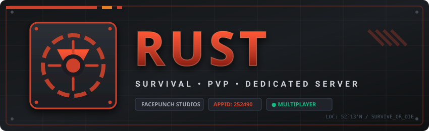

<p align="center">

  

---

## ☕ Support the Project

If this tool helped you launch and maintain your Rust server, consider buying me a coffee:

<p align="center">
  <a href="https://buymeacoffee.com/wildcatstudio" target="_blank">
    
  </a>
  <br><br>
  <a href="https://wildcatstudio.us/" target="_blank">
    
  </a>
</p>


# 🛠️ Rust Dedicated Server Manager for Windows

A turn-key, beginner-friendly toolset to install, run, update, and automate a [Rust](https://rust.facepunch.com/) Dedicated Server on Windows. 

Designed so that **anyone**, regardless of technical experience, can get a server running in minutes without manual command-line wrangling.

Official Repository: [https://github.com/djacidfx/RustServer](https://github.com/djacidfx/RustServer)

---

## ✨ Features

- **Double-Click Installer (`Install.bat`)**: Automatically installs SteamCMD, downloads the Rust Dedicated Server files, guides you through configuration, and sets up firewall rules.
- **Interactive Control Menu (`Manage.bat`)**: Start, stop, restart, update, backup, or wipe your server from a simple numbered menu.
- **Graceful WebRCON Shutdown**: Sends `server.save` and `quit` before stopping, protecting your players' structures and blueprints against rollbacks or world corruption.
- **Safety Backups Before Wipes**: Automatically archives your world saves and database to a timestamped `.zip` in `backups/` before any wipe.
- **Automated Nightly Restarts & Wipe Scheduling**: Supports automatic restarts and wipes (Weekly, Bi-Weekly, or First-Thursday Monthly forced wipes).
- **Independent Configuration**: All server properties are saved in `RustServer.config.json` so you can tweak settings without touching the code.

---

## 📋 System Requirements

| Requirement | Recommended Spec |
|---|---|
| **OS** | Windows 10, Windows 11, or Windows Server (64-bit) |
| **Processor** | Modern Quad-Core CPU (3.6 GHz+) |
| **RAM** | 16 GB minimum (Rust maps are memory-intensive) |
| **Disk Space** | 25 GB+ available on an SSD |
| **Prerequisite** | [Visual C++ 2015–2022 Redistributable (x64)](https://aka.ms/vs/17/release/vc_redist.x64.exe) |

---

## 🚀 Quick Start (Under 5 Minutes)

### 1. Download
Click the green **Code** button at the top of [https://github.com/djacidfx/RustServer](https://github.com/djacidfx/RustServer) and select **Download ZIP**, then extract it to a folder on your computer.

*(Or clone via Git:)*
```powershell
git clone https://github.com/djacidfx/RustServer.git
cd RustServer
```

### 2. Run the Installer
Right-click `Install.bat` and select **Run as Administrator**.


*(For a complete walkthrough and router port-forwarding guide, see [HOW-TO-GUIDE.md](HOW-TO-GUIDE.md).)*

Follow the on-screen prompts:
1. Choose an install directory (e.g., `C:\RustServer`).
2. SteamCMD and the Rust server files will download automatically.
3. Choose your server name, description, player count, and map size.
4. Let the installer create Windows Firewall rules and optional nightly maintenance tasks.
5. Choose whether to start the server immediately!

---

## 🎮 How Players Connect to Your Server

### Connecting Locally (You on the same PC or LAN)
1. Open Rust on your computer.
2. Press **F1** to open the in-game console.
3. Type:
   ```text
   client.connect 127.0.0.1:28015
   ```
   *(Or your local IP address if playing from another PC in your home, e.g., `client.connect 192.168.1.50:28015`)*

### Letting Friends and the Public Connect (Port Forwarding)
For friends outside your house to find or join your server, you must forward these ports in your home router settings to your computer's local IP address:

| Port | Protocol | Purpose |
|---|---|---|
| **28015** | **UDP** | Main Game Port |
| **28017** | **UDP** | Steam Server Query Port (Server Browser) |
| **28016** | **TCP** | WebRCON Administration Port |

Once forwarded, friends can join via the community browser or in console via:
```text
client.connect YOUR_PUBLIC_IP:28015
```
*(You can check your public IP on websites like [whatismyip.com](https://whatismyip.com).)*

---

## 🕹️ Day-to-Day Management

Double-click `Manage.bat` to open the control menu:

```text
==========================================================
             Rust Dedicated Server Manager
==========================================================
Server: My Rust Community Server
Status: ONLINE (PID: 14220)
==========================================================
 [1] Start Server
 [2] Stop Server (Graceful Save & Quit)
 [3] Restart Server
 [4] Update Server (SteamCMD)
 [5] Backup Server Data
 [6] Wipe Server (Map Wipe - Keep Blueprints)
 [7] Wipe Server (Full Wipe - Reset Everything)
 [8] View Detailed Status & Port Info
 [9] Open Server Log File
 [Q] Quit
==========================================================
```

### Command-Line Arguments (Advanced / Automation)

```powershell
.\Manage-RustServer.ps1 -Action start
.\Manage-RustServer.ps1 -Action stop
.\Manage-RustServer.ps1 -Action restart
.\Manage-RustServer.ps1 -Action update
.\Manage-RustServer.ps1 -Action backup
.\Manage-RustServer.ps1 -Action wipe -WipeType MapOnly
.\Manage-RustServer.ps1 -Action wipe -WipeType Full
.\Manage-RustServer.ps1 -Action status
```

---

## 🔄 Wipe & Restart Automation

If enabled during setup, Windows Task Scheduler automatically runs:
```powershell
powershell.exe -NoProfile -ExecutionPolicy Bypass -File "Manage-RustServer.ps1" -Action nightly
```
- **Regular Nights**: Cleanly saves and restarts the server to free memory and prevent lag.
- **Wipe Nights**: Automatically takes a full backup to `backups/`, wipes world saves, picks a random fresh seed, and boots the new map.

---

## 🔒 Security

- `RustServer.config.json` stores your generated RCON password. This file is excluded in `.gitignore` so your private credentials are never pushed to GitHub.

---

## 📄 License

This project is licensed under the MIT License — see the [LICENSE](LICENSE) file for details.
